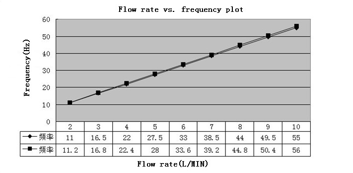
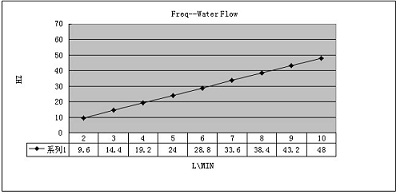
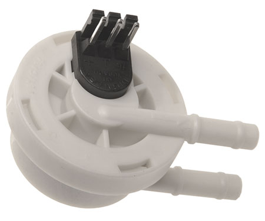

# FlowMeter

## Purpose

**FlowMeter** is an Arduino library that provides calibrated liquid flow and volume measurement with liquid flow sensors.

The library is primarily intended for use with impeller flow sensors and water, although other types of sensors and media could be made to work.

## Simple Example

Getting started with **FlowMeter** is easy. Take a look at this simple example:

```c++
void setup() {
  // prepare serial communication
  Serial.begin(9600);

  // enable a call to a helper function on every rising edge
  attachInterrupt(INT0, MeterISR, RISING);
}

void loop() {
  // wait between output updates
  delay(period);

  // process the (possibly) counted ticks
  Meter.tick(period);

  // output some measurement result
  Serial.print("Currently ");
  Serial.print(Meter.getCurrentFlowrate());
  Serial.print(" l/min, ");
  Serial.print(Meter.getTotalVolume());
  Serial.println(" l total.");

  //
  // any other code can go here
  //
}
```

In the above example, a flow sensor is assumed to be connected to the `INT0` pin. The corresponding object `Meter` is updated every `period` (in milliseconds, e.g. 1000ms) within the helper function `MeterISR`.

See the complete source code of the [**Simple**](examples/Simple/Simple.ino) example (included with this library) for more.

## Simulation Example <a id="simulation-example"></a>

```c++
// let's provide our own sensor properties, including calibration points for error correction
FlowSensorProperties MySensor = {50.0f, 4.8f, {1.2, 1.1, 1.05, 1, 1, 1, 1, 0.95, 0.9, 0.8}};

// connect a wire bridge between pins 13 and 3 in order to simulate flow sensor pulses
FlowMeter Meter = FlowMeter(3, MySensor);
```

In this example, the `FlowMeter` object `Meter` is initialized to pin 3 using a custom `FlowSensorProperties` structure `MySensor`.

This structure holds the following values (written in a compact inline notation):

```c++
MySensor.capacity = 50.0f;
MySensor.kFactor = 4.8f;
MySensor.mFactor = {1.2, 1.1, 1.05, 1, 1, 1, 1, 0.95, 0.9, 0.8};
```

The `mFactor` array provides a non-linear, flow dependent correction to the otherwise flow independent `kFactor`.
The ten data points in the array correspond to flow rates within the [(per-)centiles](https://en.wikipedia.org/wiki/Percentile) (0%, 10%, 20%, 30%, 40%, 50%, 60%, 70%, 80% and 90%) of the `capacity` value, respectively.

See [below](#calibration-and-error) for the math and motivation behind sensor calibration.

The example then randomly simulates a sensor frequency and measurement period.
The flow rate varies between 0 and `capacity` with updates after up to five seconds.

After running the simulation for a while, the average flow rate settles around `capacity/2` and the average error converges towards 0 (since the `mFactor` array has a mean value of 1).
You can of course play with the values in `MySensor` to see how this changes the behaviour.

<!---
So what this example demonstrates is how the error correction works and that the results are independent of how long or short your measurement periods are (within limits, of course).
-->

See the complete source code of the [**Simulation**](examples/Simulation/Simulation.ino) example (included with this library) for more.

## Unit of measure

The **FlowMeter** library expresses flow in the unit **l/min**.
Most units of measure can be derived by simple conversion (just try not to measure in [Sverdrups](https://en.wikipedia.org/wiki/Sverdrup)).

As an example, conversion between **l/min** and US **gal/min** can be done with a factor of *3.78541178*, conversion from **min**  to **s** with a factor of *60*.

```math
3.78541178 l/min ≈ 1 gal/min ≈ 0.0167 gal/s.
```

## Installation

Just check out the [**FlowMeter**](https://github.com/sekdiy/FlowMeter) Repository on GitHub (or download the ZIP archive) and copy it to your `libraries/` folder (usually within your Arduino sketchbook).

After (re)launching the Arduino IDE, **FlowMeter** will appear in your Sketchbook/Examples menu.

Alternatively, you can use Arduino's `Add .ZIP Library...` menu option.

## Calibration and Error <a id="calibration-and-error"></a>

The **FlowMeter** library can be used with many different flow sensors (some examples are listed [below](#example-flow-sensors)).

There's a structure **FlowSensorProperties** in the library that you can use to customize the **FlowMeter** for your flow sensor:

```c++
typedef struct {
    double capacity;        // capacity
    double kFactor;         // k-factor
    double mFactor[10];     // m-factors
} FlowSensorProperties;
```

A default set of properties is supplied in order to get you started.

#### Capacity

One quality of a flow sensor is it's **capacity**, i.e. the maximum flow that it is able to handle without stalling or failing.

Sometimes the usable capacity of a sensor is smaller than its mechanical capabilities would suggest. See the [turndown ratio](#turndown-ratio) section for details.

The **FlowMeter** stores the sensor capacity in the `capacity` field of a `FlowSensorProperties` structure.

#### K-Factor

This is the most important quality of the flow sensor you use.

In theory a flow sensor (as considered in this library) converts a frequency into a flow rate.

The conversion factor between frequency *f* and flow rate *Q* is called the K-Factor *KF*:

```math
KF = f / Q
 Q = f / KF
```

The **FlowMeter** stores the K-Factor in the `kFactor` field of a `FlowSensorProperties` structure.

#### M-Factor <a id="m-factor"></a>

Practical flow sensors are non-ideal in that their output signal contains nonlinearities.

This error can be compensated by measuring volumes at different flow rates/frequencies/volumes and deriving a set of near-unity factors.

```math
MF = Q_actual / Q_nominal
   = f_actual / f_nominal
   = V_actual / V_nominal
```

The *meter factor* is applied during **FlowMeter's** internal calculations as follows (you don't need to do this yourself):

```math
Q_corrected = f / (KF / MF)
            = (f / KF) * MF
```

The **FlowMeter** stores the M-Factor in the `mFactor` field of a `FlowSensorProperties` structure. It can take ten data points, namely the deciles *0-10%* to *90-100%* of the sensor's `capacity` value.

If you don't provide individual `mFactor` values with your custom `FlowSensorProperties`, simply fill in the unity factor *1.0*.

#### Turndown ratio <a id="turndown-ratio"></a>

The [turndown ratio](https://en.wikipedia.org/wiki/Turndown_ratio#Flow_meters) can be referred to as the "rangeability" of a sensor. It describes the ratio between maximum and minimum flow rates at which the sensor can still deliver a usable signal.

```math
turndown ratio = Q_max / Q_min
```

The turndown ratio of a typical flow meter can be  [assumed](https://en.wikipedia.org/wiki/Turndown_ratio#Typical_turndown_ratio_of_various_meter_types) as approximately 10:1.

You should consider this when choosing a flow sensor for your purpose. As a general rule, refrain from using a sensor at its absolute maximum or minimum flow rate if you expect reliable results.

<!--- source: various online finds
#### Accuracy (% RD vs. % FS)

A *%*RD* accuracy rating indicates an error referred to the meter's *capacity*

Example: 50 l/min with an accuracy of +/-1% RD means an error of +/-0.5 l/min.

{table}

"The accuracy (really inaccuracy) of mass flow instruments is specified in one of two ways, either accuracy as a percentage of full scale (% FS), or accuracy as a percentage of reading (% RD).
If an instrument has accuracy specified as % FS then the error will have a fixed value no matter where the flow is in the flow range. Take, for example, an instrument calibrated for a flow of 100 ln/min with stated accuracy 1.0% of FS. At a flow of 100 ln/min (full scale) the error will be 1% of full scale, or +/- 1 ln/min. As the flow moves way from full scale the error will still be 1% FS (+/- 1 ln/min), so at a flow of 50 ln/min that error of +/- 1 ln/min becomes a larger percentage (+/- 2%) of flow. Going further away from full scale flow further increases the error as a percentage of flow; at a flow of 10 ln/min the +/- 1 ln/min error is +/- 10% of the flow.

Accuracy
If, however, an instrument has accuracy specified as % RD then the error will always be the same percentage of the actual flow. Using the 100 ln/min instrument again as the example, but this time with a stated accuracy of 1% RD, at 10 ln/min of flow the error is only +/- 1% of the flow, better by 10 times."
-->

## Example Flow Sensors <a id="example-flow-sensors"></a>

Below are some sensors that I came across while working on the library. There are many more out there and the best choice strongly depends on the application.

#### FS300A

* Flow rate range: 1–60 l/min
* Precision: 3% (flow rate from 1L/min to 10L/min)
* K-Factor: 5.5

Source: [Seed Studio](http://www.seeedstudio.com/wiki/G3/4_Water_Flow_sensor).


Note that while the range figure suggests a turndown ratio of 60:1, the limits to the precision figure indicate an actual turndown ratio of 10:1.



The flow rate vs. frequency diagram shows two slightly different specimen of the same sensor type. While the difference may seem small, your sensor may vary.

#### FS400A

* Flow rate range: 1–60 l/min
* Precision: none stated
* K-Factor: 4.8 (sometimes falsely stated as 56)

Source: [Ultisolar](http://ultisensor.com/post/G1-Hall-Effect-Flow-Sensor-USN-HS10TA-1-60Lmin.html)


This sensor is similar to the FS300A.
Suitable for irrigation and wherever precision isn't crucial.



The values in this diagram indicate a different K-Factor for this sensor model (i.e. different frequency per flow rate values). This is a direct result of the larger impeller compared to the FS300A.

It can also be adverse to assume linearity over the whole turndown ratio, let alone the complete range. Note how the diagram starts at *2 l/min* and ends at *10 l/min*, that's a linear range of only 5:1.

#### FHKSC

* Flow rate range: 0.05–1.2 l/min (depending on model)
* Precision: 2%
* Repeatability: 0.25%
* K-Factor: 20–40 (see [datasheet](/doc/932-950xBxxx_GB_20V.pdf))

Source: [Digimesa](http://www.digmesa.com/product-details/flow-sensor-fhksc/)



A rather well documented flow sensor for the vending machine industry. Suitable in applications with lower pressures and flow rates.

Higher precision than the above examples, calibration factors can be derived from the datasheet.

## How to calibrate your own sensor

It's easy to calibrate yourself. Preferrably you'd do this after installing the sensor into your project. The flow meter then benefits from increased precision within the flow range of your application. But you can also use the procedure in order to select a certain sensor from different specimen.

1. Load the [Calibration](examples/Calibration/Calibration.ino) example into your Arduino and hook up your flow sensor.
2. Take a measuring cup, a bucket with scale or any suitable container of known size (depending on the flow rates you expect).
3. Enter your application's maximum flow rate (a.k.a. `capacity`) and the sensor's `kFactor` (as explained [above](#simulation-example)) into the line where `MySensor` is defined.
3. Apply flow and dial in a flow rate. Adjust until you get a stable reading.
4. Reset the Arduino and start filling your measurement container.
5. Once it's full (or filled to a reproducible level), take note of the current flow rate,
   nominal volume and actual (container level) volume at this time.
   Don't forget to empty your container afterwards.
6. Repeat steps 3 to 5 for ten evenly spaced flow rate settings.
   Preferrably you'd do multiple measurements per setting and average your results.

It is mandatory that you select **ten evenly spaced points**, as this is how calibration operates in the **FlowMeter** library.
Try to span the whole flow range that is relevant to your application.

Create a value table in which you record all the data. Use this table to derive the meter calibration (*M-Factor*) values as [explained above](#m-factor).

A possible template could look like this, your values will vary:

|    | flow rate (l/min)   | 2   | 4     | 6 | 8 | 10 | 12 | 14 | 16 | 18 | 20 |
|----|---------------------|-----|-------|---|---|----|----|----|----|----|----|
| Va | actual volume (l)   | 0.3 | 0.45  |...|   |    |    |    |    |    |    |
| Vn | nominal volume (l)  | 0.2 | 0.4   |   |   |    |    |    |    |    |    |
| MF | proportion (Va/Vn)  | 1.5 | 1.125 |   |   |    |    |    |    |    |... |

Finally, enter your row of *M-Factors* into the program and save it:

```c++
// enter your own sensor properties here, including calibration points
FlowSensorProperties MySensor = {20.0f, 5.5f, {1.5, 1.125, ...}};
```

You can directly *prove* your calibration by re-measuring within the flow range you just calibrated for.

In case your calculated *M-Factors* all deviate into the same direction, maybe try to correct your *K-Factor* into that direction.

Please note that this simple, volumetric calibration procedure does not compensate for deviations that result from changes in liquid viscosity or temperature.

## Documentation

For further documentation please take a look at the examples in the `examples/` folder and the source code in the `src/` folder.

You can find datasheets, diagrams and pictures in the `doc/` folder.
